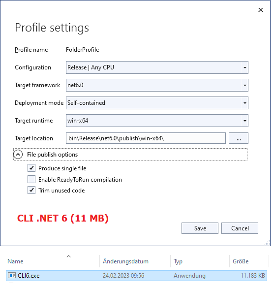
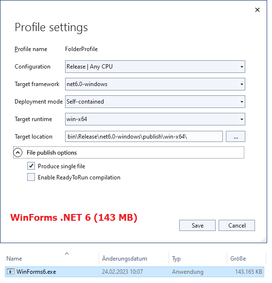
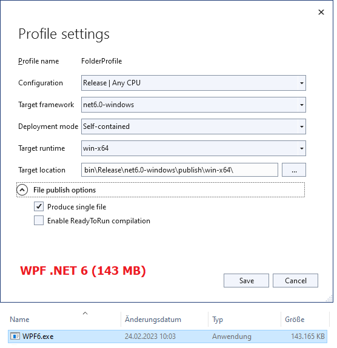
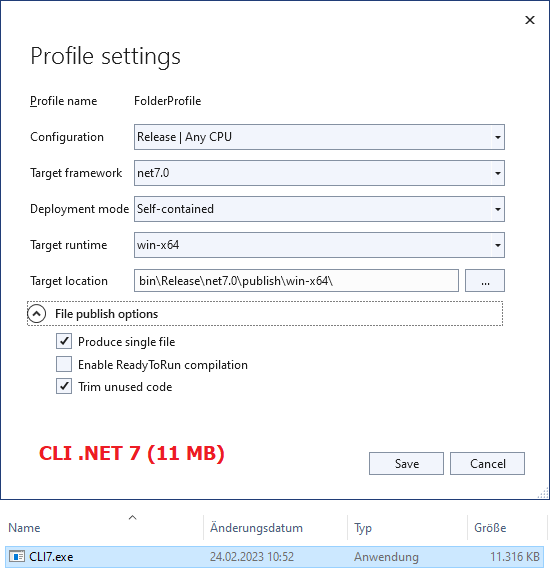
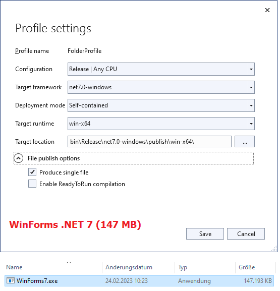
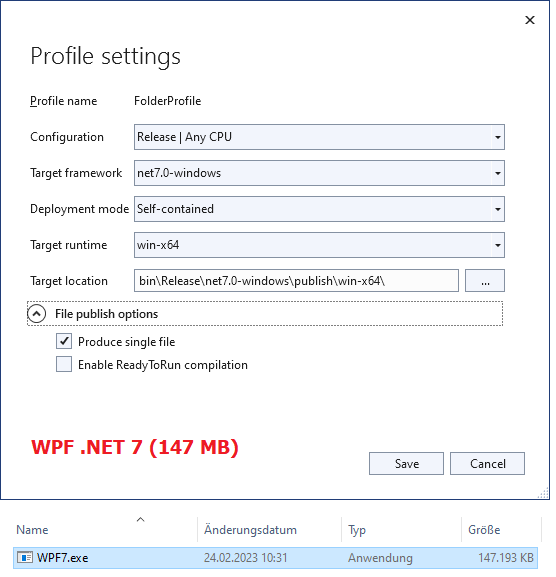

# DotNetMinimumBinarySize
Some simple testing to see how big compiled .NET binaries are in 2023

### What it is

After a short discussion about Rust and Go, with a friend of mine (greetings to Stefan here), we thought about the minimal size some different .NET binaries (executables) may have today (when compiled `self-contained` and `single file` with all "minimum output size" options, like Trimming). Therefore i quickly tested this on my own, since this seemed a good idea to me. I just used this GitHub repo to have some location to save the projects and share the results.

So, really nothing special here (translation: _super lame_). 😁

### How it is done

I just opened some different default Visual Studio 2022 .NET project templates, saved them, compiled them and then published them, with the publish options listed below. No other changes were made and no code was written. The tested project types are:

- .NET 6 CLI Application
- .NET 6 WinForms Application
- .NET 6 WPF Application
- .NET 7 CLI Application
- .NET 7 WinForms Application
- .NET 7 WPF Application

I published all of them with the following options in the Visual Studio Publish dialog (see screenshots below):

- `self-contained` as Deployment mode
- `win-x64` as Target runtime
- `Produce single file` checked
- `Enable Ready2Run compilation` unchecked (see notes below)
- `Trim unused code` checked (if existing)

No other "special tricks" (special compiler settings, hidden settings, special optimizations, and so on) were used to further decrease the output binary size. This was done on purpose, for the first step of testing here.

### Results

- 11 MB (.NET 6 CLI Application)
- 143 MB (.NET 6 WinForms Application)
- 143 MB (.NET 6 WPF Application)
- 11 MB (.NET 7 CLI Application)
- 147 MB (.NET 7 WinForms Application)
- 147 MB (.NET 7 WPF Application)

### ReadyToRun compilation

A few words here about the `ReadyToRun compilation` option of the Publish dialog in Visual Studio:

In all cases the output binary size was either the same or even bigger when activating this option. As expected. Because R2R will increase the startup speed when the application starts, but can end up in more code to achieve this goal. Therefore i did all the tests with that option unchecked, to not compare apples with oranges.

Nonetheless i discovered some interessting facts while testing:

- For CLI in .NET 6 the the R2R option increases the output binary size by __~3MB__.
- For CLI in .NET 7 the the R2R option increases the output binary size by __~3MB__.
- For WinForms in .NET 6 the R2R option has __no impact__ on the output binary size.
- For WinForms in .NET 7 the R2R option increases the output binary size by __~5MB__.
- For WPF in .NET 6 the R2R option has __no impact__ on the output binary size.
- For WPF in .NET 7 the R2R option increases the output binary size by __~12MB__.

### Additional notes
- The publish process in .NET 7 took substantially more time than in .NET 6, foremost on first publish (~52s).
- While R2R in .NET 6 had no impact on WinForms & WPF, in .NET 7 this has changed (see previous section).
- The `Trim unused code` option is only available for CLI project types.
- In contrast to earlier versions there are no other "decrease output size" options in the VS Publish dialog.

### Screenshots

#### Have fun.
